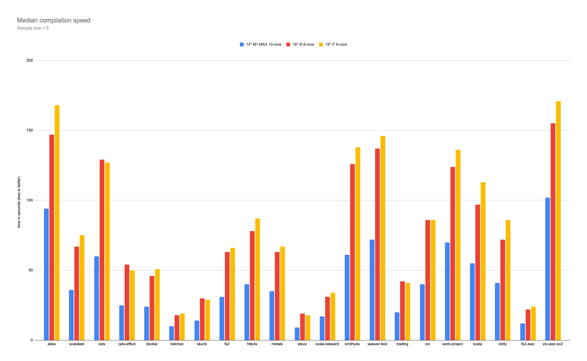

# comp-benchmark-runner

A runner for benchmarking compilation speeds across several Scala projects on MacBook Pros I have available at home.

**Disclaimer**: This is very much non-scientific and I did all this in a weekend afternoon, don't expect everything to be well-executed and accurate :) it's also the first time I prepared anything like this.

## Main takeaways

1. The M1 MAX outperforms the i9 by a factor of 1.6-2.2, depending on the project.
2. The M1 MAX was also much less noisy, although I don't have exact numbers and they were all in one room :) it definitely didn't spin its fans enough to be heard through noise-cancelling headphones, contrary to the Intels.
3. The 16" i9's performance seems embarassing compared to the much cheaper 15" i7 model.

## Hardware

### M1 MAX

MacBook Pro (14-inch, 2021)
Chip: Apple M1 MAX
Memory: 64 GB

### i9

MacBook Pro (16-inch, 2019)
Processor: 2.4 GHz 8-Core Intel Core i9
Memory: 64 GB 2667 MHz DDR4

### i7

MacBook Pro (15-inch, 2018)
Processor: 2,2 GHz 6-Core Intel Core i7
Memory: 32 GB 2400 MHz DDR4


## Methodology

### Project choice

1. Projects were chosen in an arbitrary fashion.
2. I was aiming to use both libraries and applications, as well as more or less complex builds.
3. I didn't want to deal with other build tools so everything builds in sbt.

### Configuration

1. The same JVM flags were applied to each compilation: whatever was configured in sbt's defaults, `.sbtopts` or an explicit override (zio-aws got over 16G of memory in total) was used consistently on each machine.
2. The same version of each JVM release was used between machines, however they're native to each platform (aarch64, x86).
3. All dependencies (sbt, JDKs, node/yarn for libraries that cross-compile to Scala.JS) were sourced from a Nix flake (attached in this repository).

### Execution

1. Each project was first "warmed up", which meant executing the compile command, which made sure all dependencies were available for the measured compilations.
2. All projects were compiled using sbt (version chosen by each project separately).
3. Each project was compiled 5 times one after another, with an `sbt clean` execution before each compile.
5. All compilations ran sequentially within each machine.
6. Every laptop was charging throughout the process.

### Measurement

1. The time measured was the total time of executing `sbt` with the `compile` command...
2. ...although for certain projects there was extra (sub-second) overhead of changing Java versions (entering the Nix shell): these were "work project" (jdk 11) and akka (jdk 8).
3. The "work project" was compiled in `IntegrationTest` and `Test` configurations (`Compile` is implied).

## JVM Versions

```
# Java 17
openjdk version "17.0.1" 2021-10-19 LTS
OpenJDK Runtime Environment Zulu17.30+15-CA (build 17.0.1+12-LTS)
OpenJDK 64-Bit Server VM Zulu17.30+15-CA (build 17.0.1+12-LTS, mixed mode, sharing)

# Java 11
openjdk version "11.0.11" 2021-04-20 LTS
OpenJDK Runtime Environment Zulu11.48+21-CA (build 11.0.11+9-LTS)
OpenJDK 64-Bit Server VM Zulu11.48+21-CA (build 11.0.11+9-LTS, mixed mode)

# Java 8 on ARM
openjdk version "1.8.0_292"
OpenJDK Runtime Environment (Zulu 8.54.0.21-CA-macos-aarch64) (build 1.8.0_292-b10)
OpenJDK 64-Bit Server VM (Zulu 8.54.0.21-CA-macos-aarch64) (build 25.292-b10, mixed mode)

# Java 8 on Intel
openjdk version "1.8.0_292"
OpenJDK Runtime Environment (Zulu 8.54.0.21-CA-macosx) (build 1.8.0_292-b10)
OpenJDK 64-Bit Server VM (Zulu 8.54.0.21-CA-macosx) (build 25.292-b10, mixed mode)
```

## Results

[](./images/graph.png)

**All times are in seconds (floored)** - I didn't need more precision.

### M1

| project       | round 1 | round 2 | round 3 | round 4 | round 5 |
| ------------- | ------- | ------- | ------- | ------- | ------- |
| akka          | 94      | 94      | 93      | 94      | 96      |
| scalatest     | 35      | 37      | 36      | 36      | 36      |
| cats          | 64      | 62      | 60      | 60      | 60      |
| cats-effect   | 25      | 24      | 25      | 25      | 24      |
| doobie        | 24      | 24      | 25      | 23      | 24      |
| natchez       | 10      | 10      | 10      | 10      | 10      |
| skunk         | 14      | 14      | 14      | 14      | 14      |
| fs2           | 31      | 31      | 31      | 31      | 30      |
| http4s        | 40      | 40      | 39      | 40      | 41      |
| metals        | 35      | 35      | 34      | 35      | 34      |
| steve         | 9       | 9       | 9       | 9       | 9       |
| scala-steward | 17      | 17      | 17      | 16      | 17      |
| smithy4s      | 62      | 61      | 61      | 62      | 60      |
| weaver-test   | 73      | 69      | 74      | 71      | 72      |
| trading       | 20      | 20      | 20      | 20      | 20      |
| zio           | 39      | 39      | 40      | 40      | 40      |
| work project  | 75      | 70      | 69      | 70      | 70      |
| scala         | 55      | 55      | 54      | 55      | 55      |
| dotty         | 41      | 43      | 41      | 41      | 41      |
| fs2-aws       | 12      | 12      | 12      | 12      | 13      |
| zio-aws ec2   | 107     | 102     | 102     | 102     | 107     |

### i9

| project       | round 1 | round 2 | round 3 | round 4 | round 5 |
| ------------- | ------- | ------- | ------- | ------- | ------- |
| akka          | 149     | 150     | 147     | 147     | 147     |
| scalatest     | 67      | 67      | 67      | 66      | 66      |
| cats          | 127     | 129     | 123     | 129     | 133     |
| cats-effect   | 51      | 55      | 55      | 54      | 51      |
| doobie        | 50      | 46      | 46      | 46      | 45      |
| natchez       | 18      | 18      | 18      | 19      | 18      |
| skunk         | 28      | 31      | 30      | 30      | 30      |
| fs2           | 64      | 65      | 63      | 63      | 63      |
| http4s        | 85      | 77      | 76      | 83      | 78      |
| metals        | 64      | 63      | 64      | 63      | 62      |
| steve         | 19      | 18      | 19      | 18      | 19      |
| scala-steward | 31      | 31      | 32      | 31      | 31      |
| smithy4s      | 131     | 125     | 126     | 123     | 126     |
| weaver-test   | 137     | 142     | 137     | 137     | 140     |
| trading       | 41      | 41      | 43      | 42      | 42      |
| zio           | 84      | 86      | 86      | 86      | 86      |
| work project  | 129     | 124     | 124     | 120     | 122     |
| scala         | 98      | 96      | 97      | 98      | 95      |
| dotty         | 73      | 72      | 72      | 73      | 71      |
| fs2-aws       | 22      | 21      | 21      | 23      | 23      |
| zio-aws ec2   | 161     | 158     | 153     | 152     | 155     |

### i7

| project       | round 1 | round 2 | round 3 | round 4 | round 5 |
| ------------- | ------- | ------- | ------- | ------- | ------- |
| akka          | 168     | 168     | 168     | 168     | 167     |
| scalatest     | 75      | 75      | 74      | 75      | 77      |
| cats          | 133     | 127     | 126     | 127     | 127     |
| cats-effect   | 50      | 50      | 49      | 49      | 50      |
| doobie        | 49      | 51      | 51      | 51      | 51      |
| natchez       | 19      | 19      | 19      | 19      | 19      |
| skunk         | 29      | 29      | 29      | 28      | 28      |
| fs2           | 72      | 67      | 66      | 66      | 66      |
| http4s        | 85      | 88      | 85      | 87      | 89      |
| metals        | 68      | 67      | 67      | 69      | 67      |
| steve         | 18      | 19      | 18      | 18      | 18      |
| scala-steward | 34      | 34      | 34      | 34      | 35      |
| smithy4s      | 138     | 138     | 138     | 137     | 138     |
| weaver-test   | 153     | 144     | 146     | 144     | 147     |
| trading       | 42      | 41      | 41      | 41      | 40      |
| zio           | 87      | 85      | 86      | 86      | 87      |
| work project  | 139     | 136     | 133     | 135     | 136     |
| scala         | 113     | 114     | 114     | 113     | 112     |
| dotty         | 87      | 86      | 86      | 87      | 86      |
| fs2-aws       | 24      | 24      | 24      | 24      | 23      |
| zio-aws  ec2  | 179     | 171     | 170     | 174     | 164     |

### Median times / to-m1 ratio

| project       | 14" M1 MAX 10-core | i9  | i9/m1 ratio | i7  | i7/m1 ratio |
| ------------- | ------------------ | --- | ----------- | --- | ----------- |
| akka          | 94                 | 147 | 1.6         | 168 | 1.8         |
| scalatest     | 36                 | 67  | 1.9         | 75  | 2.1         |
| cats          | 60                 | 129 | 2.2         | 127 | 2.1         |
| cats-effect   | 25                 | 54  | 2.2         | 50  | 2.0         |
| doobie        | 24                 | 46  | 1.9         | 51  | 2.1         |
| natchez       | 10                 | 18  | 1.8         | 19  | 1.9         |
| skunk         | 14                 | 30  | 2.1         | 29  | 2.1         |
| fs2           | 31                 | 63  | 2.0         | 66  | 2.1         |
| http4s        | 40                 | 78  | 2.0         | 87  | 2.2         |
| metals        | 35                 | 63  | 1.8         | 67  | 1.9         |
| steve         | 9                  | 19  | 2.1         | 18  | 2.0         |
| scala-steward | 17                 | 31  | 1.8         | 34  | 2.0         |
| smithy4s      | 61                 | 126 | 2.1         | 138 | 2.3         |
| weaver-test   | 72                 | 137 | 1.9         | 146 | 2.0         |
| trading       | 20                 | 42  | 2.1         | 41  | 2.1         |
| zio           | 40                 | 86  | 2.2         | 86  | 2.2         |
| work-project  | 70                 | 124 | 1.8         | 136 | 1.9         |
| scala         | 55                 | 97  | 1.8         | 113 | 2.1         |
| dotty         | 41                 | 72  | 1.8         | 86  | 2.1         |
| fs2-aws       | 12                 | 22  | 1.8         | 24  | 2.0         |
| zio-aws ec2   | 102                | 155 | 1.5         | 171 | 1.7         |
